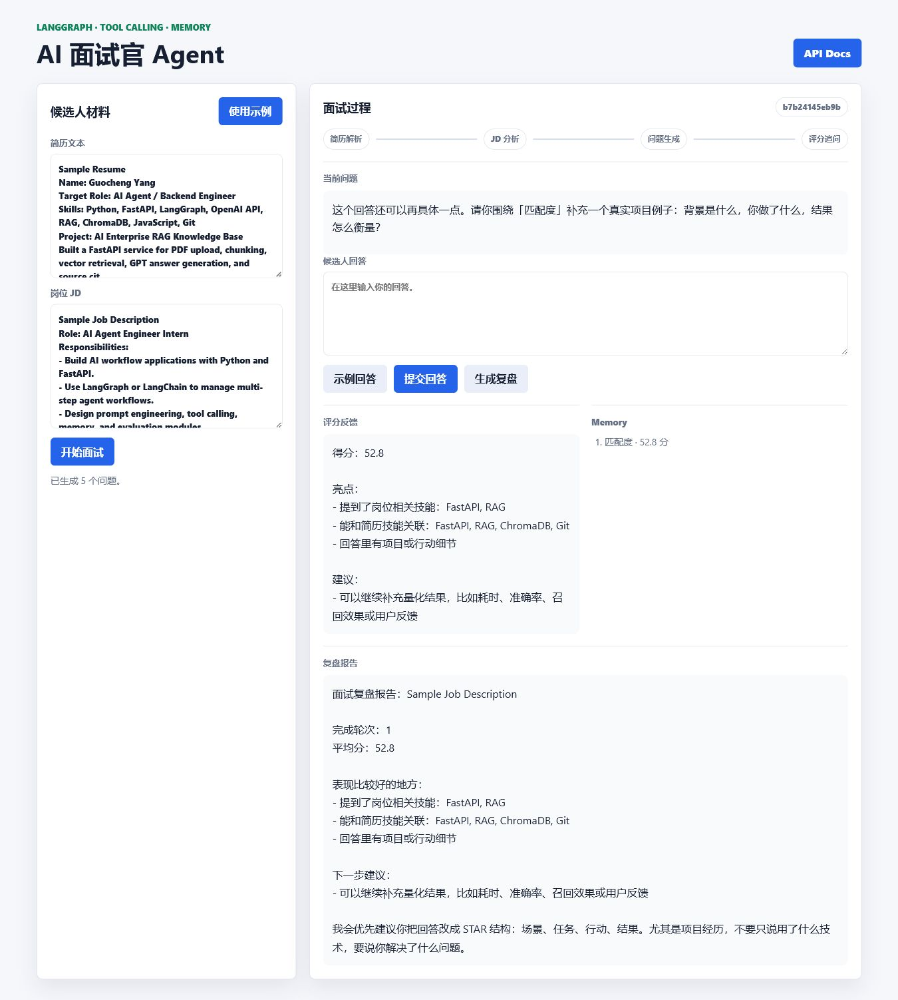
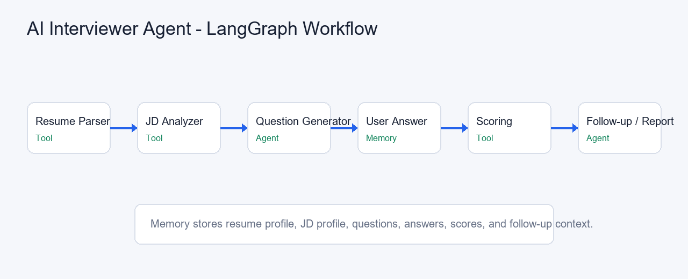

# AI 面试官 Agent

这是一个面向面试练习场景的 Agent 项目。用户提供简历和岗位 JD，系统会先解析候选人背景和岗位要求，再生成面试问题。候选人回答后，Agent 会评分、追问，并把整个过程记进 Memory，最后生成复盘报告。

我做这个项目不是为了写一个“聊天机器人壳子”，而是想把 Agent 项目里几个更关键的点串起来：**LangGraph 工作流、Tool Calling、Memory、多轮追问、评分和复盘**。



## 这个项目解决什么

很多面试准备工具只给一堆固定题目，但真实面试不是这样。面试官会根据你的简历、岗位要求和上一轮回答继续追问。

比如：

- 你简历里写了 RAG 项目，具体负责哪部分？
- JD 要求 LangGraph，你到底有没有做过 workflow？
- 你说做了 Top-K 召回，那怎么验证效果？
- 你的回答太泛了，能不能补一个真实项目例子？

这个项目就是模拟这种流程：不是一次性生成题库，而是做一个会记上下文、会追问、会复盘的 AI 面试官。

## 当前功能

- 上传或粘贴简历内容
- 上传或粘贴岗位 JD
- 使用 LangGraph 编排节点
- 使用 Tool Calling 拆分简历解析、JD 分析、评分工具
- 自动生成首轮面试问题
- 根据候选人回答进行评分
- 根据评分结果生成追问或进入下一题
- 使用 Memory 保存历史问题、回答和评分
- 生成面试复盘报告
- 提供 FastAPI 接口和 Web 演示页面
- 支持 Demo Mode，没有 OpenAI Key 也能先体验流程

## 技术栈

- Python
- FastAPI
- LangGraph
- LangChain Core Tools
- OpenAI Chat Completions
- pypdf
- HTML / CSS / JavaScript
- Uvicorn

## LangGraph 工作流



项目里拆了两条工作流：

```text
Setup Graph
START
  -> resume_parser
  -> jd_analyzer
  -> question_generator
  -> END
```

```text
Answer Graph
START
  -> user_answer
  -> scoring
  -> followup
  -> END
```

这样做有个好处：开始面试和提交回答是两个不同阶段。开始阶段负责理解材料，回答阶段负责评分和追问，Memory 在中间把状态接住。

## Tool Calling 设计

当前有 3 个工具：

- `parse_resume_tool`：把简历文本解析成候选人画像，包括技能、项目、经验等
- `analyze_jd_tool`：把 JD 解析成岗位画像，包括技能要求、职责、岗位重点等
- `score_answer_tool`：根据问题、回答、JD 技能和简历技能给出评分与反馈

这里的工具调用先保持简单、可读。它不是为了炫技，而是为了让每个节点职责清楚：解析归解析，评分归评分，追问归追问。

## Memory 设计

每个面试 session 会保存：

- 简历原文
- JD 原文
- 结构化简历信息
- 结构化 JD 信息
- 已生成的问题列表
- 当前问题
- 历史问题和回答
- 每轮评分
- 工具调用记录

所以它可以做到连续追问，而不是每次回答都像第一次见到用户。

## 项目结构

```text
ai-interviewer-agent/
├─ app.py
├─ requirements.txt
├─ README.md
├─ data/
│  ├─ sample_resume.pdf
│  └─ sample_jd.pdf
├─ static/
│  ├─ index.html
│  ├─ styles.css
│  └─ app.js
└─ screenshots/
   ├─ interview_demo.png
   └─ workflow_graph.png
```

## 快速运行

安装依赖：

```bash
pip install -r requirements.txt
```

启动服务：

```bash
uvicorn app:app --reload
```

打开 Web 页面：

```text
http://127.0.0.1:8000/
```

打开 API 文档：

```text
http://127.0.0.1:8000/docs
```

默认会开启 Demo Mode，不配置 OpenAI Key 也能跑完整流程。如果想接真实模型：

```powershell
$env:INTERVIEWER_DEMO_MODE="false"
$env:OPENAI_API_KEY="你的 API Key"
uvicorn app:app --reload
```

## 接口说明

### `POST /upload_resume`

上传简历文件，支持 PDF / TXT / MD。

### `POST /upload_jd`

上传岗位 JD 文件，支持 PDF / TXT / MD。

### `POST /start_interview`

开始面试，返回第一轮问题和结构化解析结果。

请求示例：

```json
{
  "resume_text": "候选人简历文本",
  "jd_text": "岗位描述文本"
}
```

### `POST /answer`

提交候选人回答，返回评分、反馈、Memory 和下一轮追问。

请求示例：

```json
{
  "session_id": "session id",
  "answer": "我的回答..."
}
```

### `POST /report`

生成面试复盘报告。

## 可验证结果

当前演示版本可以直接验证：

- 示例简历 PDF：`data/sample_resume.pdf`
- 示例 JD PDF：`data/sample_jd.pdf`
- 生成 5 个初始面试问题
- 提交回答后返回分数、亮点、改进建议
- Memory 展示已回答轮次
- 低分回答会触发追问
- 支持生成复盘报告

## 面试时我会怎么讲

这个项目我会按 V1 来讲，不会说它已经是完整面试平台。它更像是一个能运行的 Agent 原型：先把简历、JD、问题、回答、评分、追问这些步骤串起来。

如果面试官问为什么没有数据库，我会直接说：现在 Memory 先存在内存里，目的是把 LangGraph 工作流和多轮追问跑通；如果继续做，下一步就是把 session 和历史问答持久化。

我单独放了一份 [PROJECT_NOTES.md](PROJECT_NOTES.md)，里面是我自己准备讲解时会看的笔记。

## 我觉得这个项目最能展示的点

第一，它不是单次 Prompt 问答，而是拆成了工作流。LangGraph 负责把“解析、分析、生成问题、评分、追问”这些步骤组织起来。

第二，它有 Memory。面试这种场景没有上下文就很假，上一轮回答会影响下一轮追问，这才更像真实面试。

第三，它把工具拆开了。简历解析、JD 分析、评分不是糊在一个大函数里，而是以 tool 的形式被节点调用，后面要替换成更强的模型或规则也比较方便。

当然它现在还是 V1：没有用户系统，没有数据库，没有复杂权限，也没有真正的长期记忆。这个阶段我更想先把 Agent 的主流程做清楚。

## 可以写进简历的版本

长版：

> AI 面试官 Agent：基于 LangGraph 构建多节点工作流，实现简历解析、JD 分析、面试问题生成、连续追问、评分和复盘报告。项目使用 Tool Calling 拆分简历解析、JD 分析、评分模块，并通过 Memory 保存历史问题和回答，实现多轮面试上下文管理。提供 FastAPI 接口和 Web 演示页面，可直接展示完整面试流程。

短版：

> 构建 AI 面试官 Agent，支持简历解析、岗位分析、问题生成、多轮追问和评分，使用 LangGraph + Tool Calling + Memory 管理面试工作流，并提供可运行 FastAPI 接口和 Web 演示。

## 后续优化

- 接入数据库，持久化 session 和 Memory
- 支持真实文件管理和删除
- 增加岗位维度评分 Rubric
- 支持语音面试
- 支持多岗位题库模板
- 把评分拆成技术能力、表达能力、项目深度三类
- 增加 Docker 部署
- 增加自动化测试和 CI
